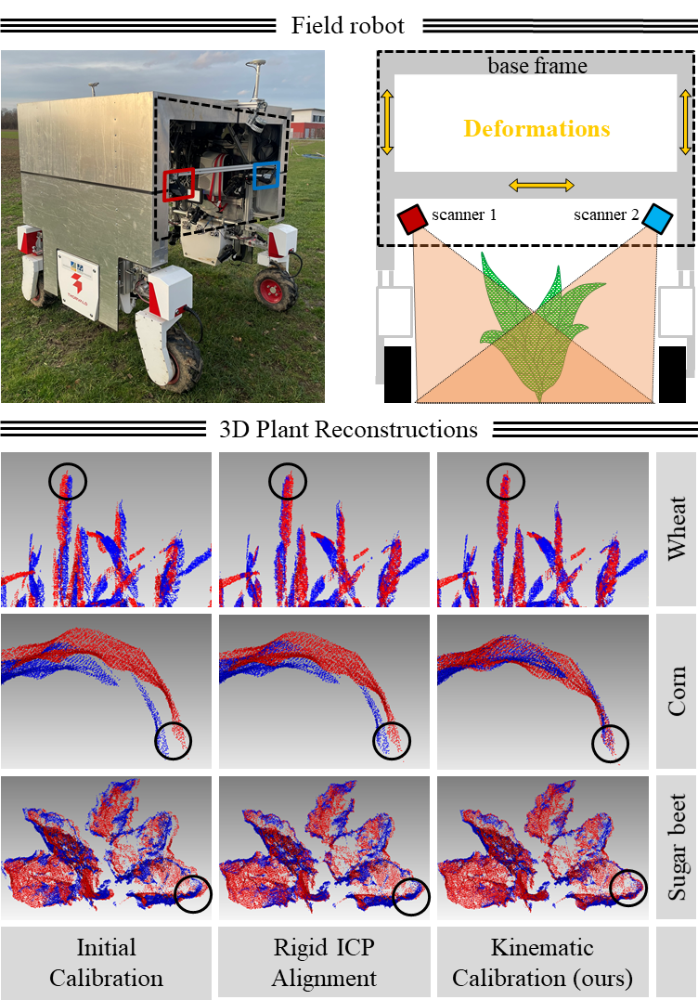

<figure style="width: 100% !important; margin: 0 !important; padding: 0 !important; clear: both !important;">
  
  <figcaption style="margin-top: 12px !important; text-align: center !important; font-family: sans-serif !important; font-size: 0.9em !important;">
    (c) Field robot and schematic structure...
  </figcaption>
</figure>

### Description

This repository contains the code of a kinematic calibration approach implemented for the kinematic dual laser scanning system of our ground Unmanned Ground Vehicle (UGV). The robot is designed to generate high-resolution 3D point clouds of various crops such as beans, wheat, soybeans, sugar beets, corn, and potatoes, in agricultural fields. The U-shape design of the 2×2×2m robot causes the scanner mounting calibration relative to the GNSS/IMU trajectory to change over time when driving in uneven field environments. To address this problem, the method estimates time-dependent mounting calibration updates by:

1. Creating initial point clouds using rigid mounting calibration of both scanners
2. Application of an sliding window approach to cut point clouds along the vehicles trajectory
3. Registration of point cloud cuts by using an ICP algorithms with a symmetric plane-to-plane objective function and robust point matching
4. Computation of the mounting calibration updates by dividing the estimated ICP transformation to the scanners
5. Robust interpolation of the updates to all laser profiles of the scanners

Finally, the aligned point clouds are generated by integrating the interpolated calibration updates into the direct georeferencing equations for both scanner with

$$
\Huge \mathbf x_{i_{[l]}}^{e}(t) = \mathbf T_{b}^{e}(t) \Delta \mathbf T_{s_{[l]}}^b(t) \mathbf T_{s_{[l]}}^b \mathbf x_{i}^{s_{[l]}}(t).
$$

This direct georeferencing equation contains the following transformations:

- $\Large \mathbf x_{i_{[l]}}^{e}(t) $: Object point $i$ in the Earth coordinate system at time $(t)$.

- $\Large \mathbf{T}_{b}^{e}(t)$: Trajectory of the UGV represented as transformation matrix from body reference frame to the Earth reference frame at time $(t)$. It is estimates using a factor graph based trajectory estimation method which fuses GNSS and IMU data, details here: [IEEE RAM](https://ieeexplore.ieee.org/abstract/document/10302421), [Arxiv Version](https://arxiv.org/pdf/2310.11516)

- $\Large \Delta \mathbf T_{s_{[l]}}^b(t)$: Mounting calibration updates for the scanner $s_{[l]}$ in the body referenec frame over time $(t)$.

- $\Large \mathbf T_{s_{[l]}}^b$: Rigid mounting calibration for the sensor $s_{[l]}$ in the body reference frame. It is estimated using a plane-based calibration approach as described here: [IEEE ICRA24](https://ieeexplore.ieee.org/document/10610208), [Arxiv Version](https://arxiv.org/pdf/2403.17788)


- $\Large \mathbf x_{i}^{s_{[l]}}(t)$: Object point $i$ in the sensor $s_{[l]}$ reference frame at time $(t)$.


## Installation (Python Environment)

```bash
python -m venv venv
source venv/bin/activate
pip install -r requirements.txt
```

## Installation (Docker)

The repository also contains Dockerfile. Please build and run the docker using the following commands:
  ```bash
  docker build -t sliding_icp_docker .
  docker run -it --name your_test_run sliding_icp_docker:latest 
  ```
# FieldPheno4D dataset

The kinematic calibration method is tested on the "FieldPheno4D" dataset described at [FieldPheno4D](https://github.com/felixesser/FieldPheno4D). It contains spatio-temporal pointclouds georeferenced with an accuracy of some centimeter containing crop varieties of bean, wheat, soybean, corn, potato, sugar beet, and brassica planted in rows in crop plots with dimensions of 8.0 times 1.5 meter.

# Acknowledgments

This work has been funded by the Deutsche Forschungsgemeinschaft (DFG, German Research Foundation) under Germany’s Excellence Strategy, EXC-2070 – 390732324 – PhenoRob.